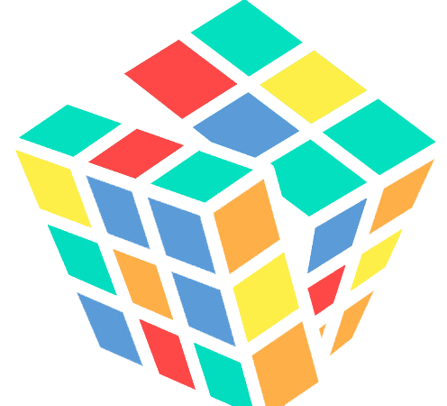

<h1 align="center">Play UI</h1>

A Vue.js prebuilt component library based on <a herf="https://github.com/htmlstreamofficial/preline">Preline</a> design draft that allows you to make beautiful websites.

  
  
  
  

## Why

The starting point of this project is personal learning, but not limited to it. I will also start other interesting projects in the future. If you like, welcome to join us. Let's explore various interesting technologies together.

## TODO

- Chinese documents
- New components
- CDN
- Playground

## Features

- 🌈 Components Design - Play UI provides neat & beautiful crafted UI components.
- 🔥 Introduce on demand - Provide resolver to automatically import only used components.
- 🎉 TS Supported - Support TypeScript & type checked & type inference.

## Usage

👉 [Here!](https://playui.netlify.app/guide/install.html)

## Contributing

Developers interested in contributing should read the [Code of Conduct](./CODE_OF_CONDUCT.md) and the [Contributing Guide](./CONTRIBUTING.md).

Thank you to all the people who already contributed to PlayUI!

## Credits

[Onu UI](https://github.com/onu-ui/onu-ui)

[Preline UI](https://github.com/htmlstreamofficial/preline)

## License

[MIT](./LICENSE) License © 2023 [jwhupup](https://github.com/jwhupup)
